/svg
# Cobots in the Remanufacturing Lab

## Available robots
|Manufacturer | Type | Serial number | Controller (ser.nr.) | Color | Place | Payload | Documentation |
|-------------|------|---------------|------------|-------|-------|---------|-------------------|
|Doosan |M1509 | SJZ3G7 | CS-01 (CS-01-22-04-004) | White | Right | 15 kg | [Manual](https://v2-manual.scroll.site/en/v2-user-manual/2.12.4/1-m-h-series/system-power-on-off) | 
|Doosan |A0509S| XHC9A4 | CS-03 (CS-03-22-08-004) | Blue | Middle | 5 kg | [Manual](https://v2-manual.scroll.site/en/v2-user-manual/2.12.4/1-m-h-series/system-power-on-off) |
|Doosan |A0509S| XJD0C2 | CS-03 (CS-03-22-07-017) | Blue | Left | 5 kg | [Manual](https://v2-manual.scroll.site/en/v2-user-manual/2.12.4/1-m-h-series/system-power-on-off) |
|Universal Robots | UR5 | 2016351899 | CB3UR5 (2016351899) | Grey | Back | 5 kg | [Manual](https://www.universal-robots.com/download/manuals-cb-series/user/ur5/315/user-manual-ur5-cb-series-sw315-english-international-en/)|

For installation, user, and programming manuals also see the [Doosan-robots folder](https://dehaagsehogeschool.sharepoint.com/:f:/r/sites/RemanufacturingLab-StudentTeams_groups/Gedeelde%20documenten/0_General/03-Suppliers%20and%20Components/Doosan-robots?d=we34f657cc8284186989502052e120ae5&csf=1&web=1&e=epfa2n) in the [0_General](https://dehaagsehogeschool.sharepoint.com/:f:/r/sites/RemanufacturingLab-StudentTeams_groups/Gedeelde%20documenten/0_General?d=w1a3b07ce0bff4baf9253450d6b24bf5f&csf=1&web=1&e=PiCUap) folder on the RemanufacturingLab sharepoint.

## Network architecture

This is the intended architecture for every Doosan cobot cell. Note,  that the Homberger hub is a Raspberry Pi with a special image to communicate with Doosan cobots through the DRL [DRL (Doosan Robot Language)](https://manual.doosanrobotics.com/en/programming-manual/3.7.0/publish), and thus is not necessary in cells with a Universal Robot.

You can bring your own laptop (BYOD stands for Bring Your Own Device) and hook it up to the cobot cell. The preferred network connection is through ethernet.

Each cell consists of the following devices:
 - **Robot with controller**: to manipulate, controlled through DRL Studio (Doosan), UR-script (UR) or ROS2 (Doosan and UR)
 - **Homberger hub** (only for Doosan cobots): to connect laptops (BYOD) running DRL studio to the robot
 - **Rasberry Pi**: running ROS2, so you don´t have ROS2 running on your laptop
 - **Network switch**: to connect all devices with eachother in a local static network (note, there is no DHCP server running in the network)
 - **Laptop (BYOD)**: your laptop, see below for guidance how to connect it to the network

| Cell                   | Device        | IP-address      |
|------------------------|---------------|-----------------|
| Doosan M1509 (right)   | Robot         | 192.168.137.100 |
|                        | Homberger hub |                 |
|                        | Nvidia Jetson |                 |
| Doosan A0509S (middle) | Robot         | 192.168.137.100 |
|                        | Homberger hub |                 |
|                        | Raspberry Pi  |                 |
| Doosan A0509 (left)    | Robot         | 192.168.137.100 |
|                        | Homberger hub |                 |
|                        | Raspberry Pi  |                 |
| UR5 (back)             | Robot         | 192.168.137.100 |
|                        | Homberger hub |                 |
|                        | Raspberry Pi  |                 |

## Controlling Doosan cobots
In principle, there are several possibilies to control a Doosan robot, discussed below. We have limited the options to DRL studio and ROS2 to standardize a bit and enhance the reuse of code.

### DRL studio
This is adviced for basic robot manipulation tasks, DRL studio is a program that runs on your laptop and sends robot code in python via the Homberger Hub to the Doosan robot controller. 
